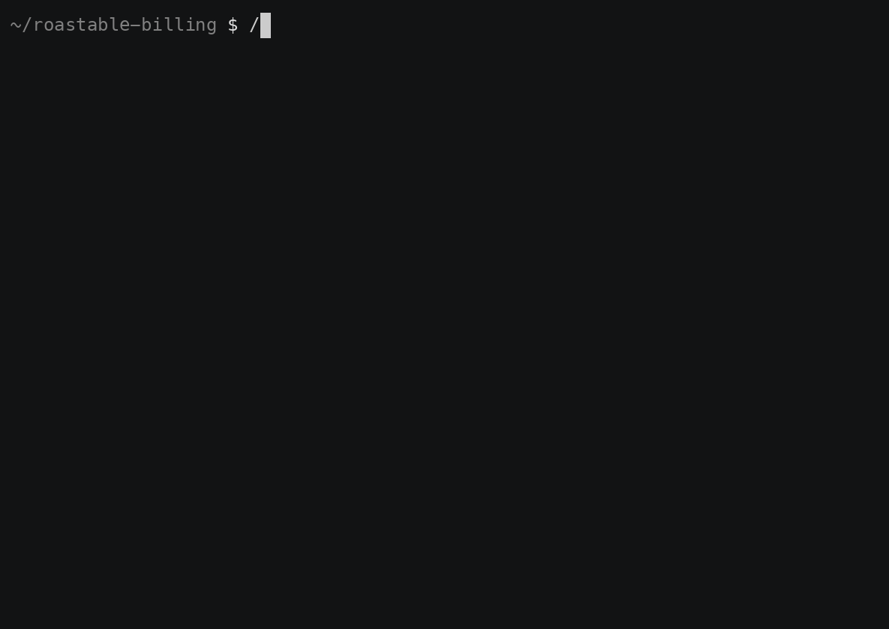

# fintech-roast

[](https://github.com/DylanMerigaud/fintech-roast/actions/workflows/ci.yml)
[](LICENSE)

An agent that roasts the code that touches money.



<sub>A replay of the run scored in [eval/RESULTS.md](eval/RESULTS.md) (53 findings over the
planted-bug fixture). Real rule ids and file lines; the report shape the plugin prints.</sub>

It scans a repository for the surfaces where money lives (schemas, webhooks, calculation
code, serialization), audits each against a sourced rulebook of how money-handling code
actually breaks, adversarially verifies every finding, and reports what survives with the
rule and the sources behind it.

Building in public. The rulebook, the plugin, and a first benchmark are here. The rulebook
gives per-language detection and fixes for JavaScript/TypeScript and Python today, with Java
in progress. Results live in [`eval/`](eval/).

## Why this exists, and what it is not

Most "AI code review" for money is a single prompt that pattern-matches on "float" and
calls it a day. The value here is not the prompt, it is **the rulebook**: 40 rules across
10 domains, with per-language detection and fixes for JavaScript/TypeScript and Python (Java
in progress), each one researched against primary sources (specs, standards, tax-authority
manuals, canonical engineering literature), each one carrying its own false-positive notes,
and each one put through an adversarial pass whose only job was to refute it. The agent is
just the mechanism that applies the rulebook to your code.

The authority is meant to come from findings you can check and rules you can cite, not from
a claim of expertise. Findings are rule-based and adversarially verified by a second agent;
they are not a substitute for a human who owns the money path. Read the cited rule before
you act on a finding. Every rule documents where it cries wolf.

## The rulebook

40 rules, in [`rules/`](rules/). Each rule: what to detect, why it breaks (with real
incidents where they exist), the fix, its false positives, and at least two authoritative
sources. Format contract and severity scale in [`rules/README.md`](rules/README.md).

| Domain | Rules | A few of the failures it catches |
| --- | --- | --- |
| [Storage and types](rules/storage-and-types.md) | STO-1..7 | float money, wrong DECIMAL scale, ambiguous minor units, missing currency, hardcoded 2 decimals, type overflow, exact-decimal built from a float |
| [Rounding and allocation](rules/rounding-and-allocation.md) | ROU-1..4 | implicit rounding mode, splits that do not sum to the total, order-dependent discount/tax, divide-before-multiply |
| [Idempotency and concurrency](rules/idempotency-and-concurrency.md) | IDE-1..4 | non-idempotent webhooks, missing idempotency keys, balance read-modify-write races, no unique constraint backstop |
| [Ledger design](rules/ledger-design.md) | LED-1..4 | mutating posted entries, single-entry money movement, drifting cached balances, no audit trail |
| [FX and multi-currency](rules/fx-and-multicurrency.md) | FX-1..4 | round-trips assumed lossless, rates applied without capture, original amount discarded, cross-currency arithmetic |
| [Time and dates](rules/time-and-dates.md) | TIM-1..4 | period math in the server zone, DST-naive day counts, ambiguous statement boundaries, hardcoded day-count basis |
| [Aggregation and reporting](rules/aggregation-and-reporting.md) | AGG-1..3 | float sums, precision lost at ORM/JSON boundaries, paginated aggregation that double-counts |
| [Taxes](rules/taxes.md) | TAX-1..3 | line vs document rounding level, inclusive/exclusive confusion, float tax rates |
| [API and serialization](rules/api-and-serialization.md) | API-1..4 | money as a JSON number, GraphQL Float, parseFloat on input, no canonical cross-service shape |
| [Testing money code](rules/testing.md) | TST-1..3 | no property tests on invariants, round-number fixtures, one happy currency |

## The plugin

A Claude Code plugin. It adds a `/fintech-roast:roast` skill that scans for money surfaces,
fans out one auditor per domain, adversarially verifies the findings, and reports with rule
citations. It runs on your own Claude session, so there is no API key to configure.

```
/plugin marketplace add DylanMerigaud/fintech-roast
/plugin install fintech-roast@fintech-roast
/fintech-roast:roast
```

It is read-only. It never edits your code, opens PRs, or files issues.

## Evaluation

[`eval/`](eval/) holds a deliberately buggy billing service with money bugs planted across
all ten domains, and an answer key. The fixture compiles clean and its tests pass, because
the tests use round numbers and one currency, which is the point (see TST-2, TST-3). The
scorer (`eval/score.py`) measures how many planted bugs the agent finds and how many of its
findings land on a real planted bug. Per-language runs are tracked separately, each with its
own method and caveats so the numbers are not read out of context: the TypeScript run (a cold
full-repo scan, recall 86 percent) in [`eval/RESULTS.md`](eval/RESULTS.md), and the Python run
(audited per domain against a matching Python fixture in [`eval/fixture-py/`](eval/fixture-py/))
in [`eval/RESULTS-py.md`](eval/RESULTS-py.md). The honest version, including misses and the
limits of each run, stays in the repo.

## Contributing

The rules are claims about how money code breaks. If one is wrong, overstated, or missing a
jurisdiction nuance, [say so](CONTRIBUTING.md). That is the most valuable thing you can do
here.

## License

MIT.
